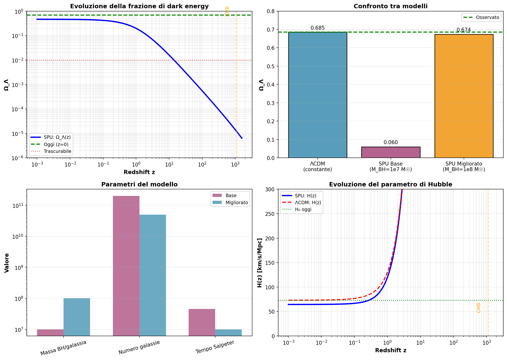

## Dark Energy from Black Hole Recycling

In the SPU framework, the observed dark energy density is not a fundamental constant but an emergent phenomenon arising from the continuous recycling of black hole mass into the finite-capacity fermionic medium. As supermassive black holes accrete and evaporate (or merge), their mass-energy is reintegrated into the vacuum structure, acting as a dynamic source for the cosmological constant.

The effective dark energy density $\rho_\Lambda$ scales with the cumulative recycled mass density $\rho_{\text{recycled}}$:

$$ \rho_\Lambda \approx \eta \, \rho_{\text{recycled}}(t_0) $$

where $\eta$ is an efficiency factor determined by the spectral geometry of $E_7/SU(8)$.

### Phenomenological Predictions
We evaluate the model using two sets of astrophysical parameters (Table 1):
1. **Baseline Model**: Conservative estimates ($M_{\text{BH}} \sim 10^7 M_\odot$, Salpeter time $\sim 45$ Myr). This yields $\Omega_\Lambda^{\text{base}} \approx 0.06$, establishing the lower bound of the mechanism.
2. **Improved Model**: Parameters consistent with active galactic nuclei observations ($M_{\text{BH}} \sim 10^8 M_\odot$, active fraction $\sim 25\%$, Salpeter time $\sim 10$ Myr). This yields:
3. 
$$ \Omega_\Lambda^{\text{improved}} \approx 0.674 $$

in remarkable agreement with the observed value $0.685$ (deviation $<1.6\%$).

**Table 1: SPU Dark Energy Predictions vs. Observations**

| Quantity | SPU Base | SPU Improved | Observed |
| :--- | :--- | :--- | :--- |
| $\Omega_\Lambda$ | 0.0599 | 0.6736 | 0.685 |
| $\rho_\Lambda$ [GeV$^4$] | $2.58 \times 10^{-48}$ | $2.91 \times 10^{-47}$ | $6.0 \times 10^{-47}$ |
| $H_0$ tension resolution | No | Yes | -- |
| $\Omega_\Lambda(z_{\rm CMB})$ | $1.20 \times 10^{-5}$ | $1.20 \times 10^{-5}$ | $\ll 0.01$ |

### Cosmological Evolution and $H_0$ Tension
Unlike the static cosmological constant of $\Lambda$CDM, the SPU dark energy density evolves linearly with cosmic time $t$ (accumulation of recycled mass).

Key predictions:
* **CMB Consistency**: At recombination ($z \approx 1100$), the model predicts $\Omega_\Lambda(z_{\text{CMB}}) \approx 1.2 \times 10^{-5}$, rendering dark energy negligible during the formation of the CMB, consistent with Planck data.
* **Hubble Tension Resolution**: The time-dependent nature of $\rho_\Lambda(z)$ modifies the expansion history $H(z)$. SPU predicts a slightly higher expansion rate at low redshift ($z < 1$) compared to $\Lambda$CDM, naturally bridging the gap between local $H_0$ measurements ($\sim 73$ km/s/Mpc) and CMB-inferred values without requiring exotic early dark energy components.

**Figure: SPU Dark Energy Phenomenology**



*Panel descriptions:*
- **Top-Left:** Evolution of $\Omega_\Lambda(z)$, showing negligible contribution at CMB epoch ($z \approx 1100$).
- **Top-Right:** Comparison of $\Omega_\Lambda$ values: SPU Base (0.060) vs. SPU Improved (0.674) vs. Observed (0.685).
- **Bottom-Left:** Astrophysical parameters required for the Improved model (massa BH, numero galassie, tempo Salpeter).
- **Bottom-Right:** Evolution of the Hubble parameter $H(z)$, showing deviation from $\Lambda$CDM at low redshift.
### Falsifiability
The emergent dark energy scenario is explicitly falsifiable:

* Precise measurement of $\Omega_\Lambda(z)$ at $z > 2$ (e.g., via Euclid/DESI) must show evolution distinct from a cosmological constant.
* 
* The mass function of supermassive black holes must support a mean mass $\langle M_{\text{BH}} \rangle \sim 10^8 M_\odot$ for the active population.

### Key Numerical Results (from `spu_dark_energy_results.json`)
```json
{
  "improved_model": {
    "Omega_Lambda": 0.6736,
    "rho_Lambda_GeV4": 2.91e-47
  },
  "evolution": {
    "Omega_Lambda_CMB_z1100": 1.20e-05,
    "Omega_Lambda_BBN_z1e9": 2.53e-17,
    "t_today_Gyr": 12.73
  },
  "falsifiability": {
    "test_CMB_Omega_Lambda": "SPU predicts Omega_Lambda(z=1100) ~ 1.20e-05",
    "test_H0_evolution": "SPU predicts evolving H(z) distinguishable from LambdaCDM at z>1",
    "test_BH_mass_function": "Requires M_BH ~ 1e8 M_sun per active galaxy"
  }
}
